# netty-transport-nethernet

## Usage

> [!IMPORTANT]
> This library uses [libdatachannel-java](https://github.com/opencollab-incubator/libdatachannel-java) and needs its platform-specific native library at runtime. The main artifact contains no natives, so you have to add the classifier(s) for the platforms you ship yourself.

```kotlin
val nativePlatforms = listOf(
    "windows-x86_64",
    "x86_64",        // linux x86_64
    "aarch64",       // linux aarch64
    "macos-x86_64",
    "macos-arm64"
)

dependencies {
    implementation("org.cloudburstmc.netty:netty-transport-nethernet:$netherNetVersion")
    nativePlatforms.forEach { platform ->
        runtimeOnly("dev.opencollab:libdatachannel-java:$libdatachannelVersion:$platform")
    }
}
```

### Examples

These projects use this library to provide Nethernet support. You can see their source code for examples of how to use this library:

- [Kas-tle/ProxyPass](https://github.com/Kas-tle/ProxyPass): Uses server and client to debug game packets over various connection types.
- [MCXboxBroadcast/Broadcaster](https://github.com/MCXboxBroadcast/Broadcaster): Uses server to allow Bedrock clients to transfer to other Bedrock servers via Xbox Live.
- [ViaVersion/ViaFabricPlus](https://github.com/ViaVersion/ViaFabricPlus): Uses client to connect to LAN games and Realms.
- [ViaVersion/ViaProxy](https://github.com/ViaVersion/ViaProxy): Uses client to connect to LAN games and Realms.

## Packet Flow

### Client

---

<picture>
  <source media="(prefers-color-scheme: dark)" srcset="../.github/readme/nethernet_client_dark.svg">
  
</picture>

### Server

---

<picture>
  <source media="(prefers-color-scheme: dark)" srcset="../.github/readme/nethernet_server_dark.svg">
  
</picture>